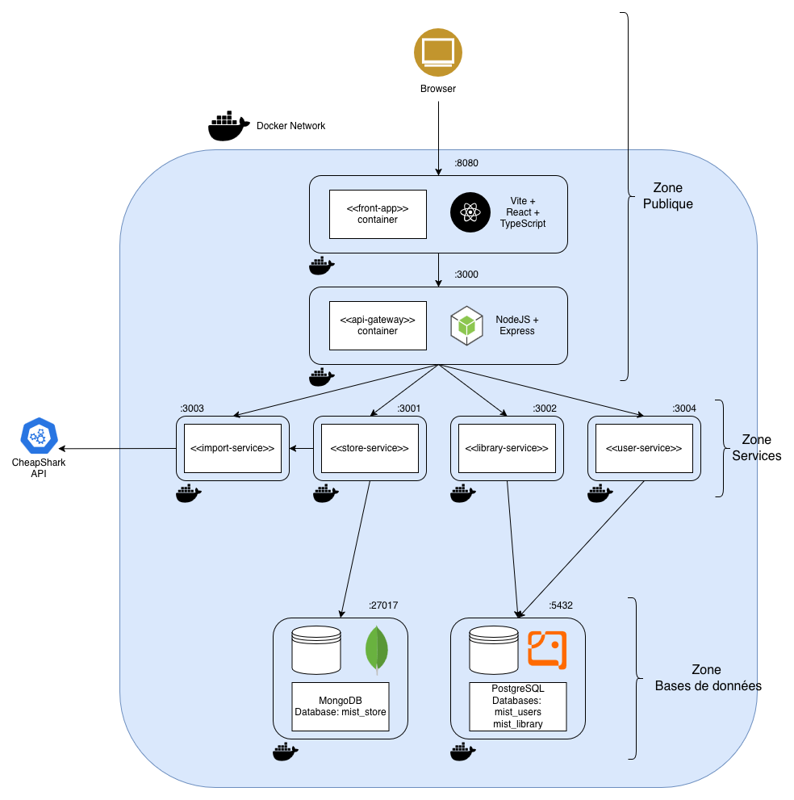

# TP Fullstack - Mist project

## Explications du projet

**Mist** est une application web conçue pour résoudre la fragmentation du jeu vidéo sur PC. Elle agit comme un **Méta-Catalogue** centralisant vos bibliothèques, vos envies d'achat et le lancement de vos jeux, le tout depuis votre navigateur desktop.

> *Arrêtez de chercher où sont vos jeux. Jouez.*

### 🎯 Le Problème

Aujourd'hui, un joueur PC doit jongler entre **Steam, Epic Games, GOG, Battle.net** et ses émulateurs. Résultat : des jeux oubliés, des achats en double, et une perte de temps à chercher où lancer tel ou tel jeu.

### 💡 La Solution - Mist en 3 Piliers

#### 1. 📚 **Bibliothèque Unifiée & Hybride**
Centralisez TOUS vos jeux, peu importe leur origine :
- **Import automatique** depuis vos profils publics (Steam, Epic...)
- **Ajout manuel** pour jeux rétro, émulateurs, Nintendo, jeux physiques
- **Gestion de backlog** avec statuts personnalisés (*À jouer, En cours, Terminé, Abandonné*)

#### 2. 💰 **Comparateur de Prix Intelligent**
Ne payez plus jamais le prix fort :
- **Agrégateur multi-stores** : Comparez Steam, Epic, GOG, marchés de clés
- **Décision éclairée** : Vérifiez où acheter avant de sortir la carte bleue
- **Historique de prix** : Identifiez les vraies promotions

#### 3. 🚀 **Hub de Lancement Desktop**
Lancez vos jeux directement depuis le navigateur :
- **Deep linking** via protocoles natifs (`steam://`, `com.epicgames.launcher://`)
- **Zéro installation** : Contrairement à GOG Galaxy ou Playnite, Mist est 100% web
- **Interface unifiée** : Un seul endroit pour gérer et lancer tous vos jeux PC

### 🎮 Fonctionnalités Actuelles

Cette plateforme permet actuellement aux utilisateurs de :
- ✅ Parcourir un catalogue de jeux avec recherche et filtres avancés (Steam-like)
- ✅ Acquérir des jeux au sein de ce catalogue
- ✅ Gérer leur bibliothèque de jeux acquis
- 🚧 Ajouter manuellement des jeux de toutes plateformes *(en cours)*
- ✅ Organiser leur backlog avec des statuts
- 🚧 Lancer leurs jeux directement depuis le navigateur *(à venir)*
- ✅ Comparer les prix entre stores 

---

## Schéma d'architecture détaillé



1. __Zone publique__: 
* Browser: pour que l'utilisateur accède à l'application web
* Frontend: Conteneur Docker avec Vite + React + TypeScript 
* API Gateway : Conteneur Docker avec NodeJS + Express + http-proxy-middleware. Gère le routage et redirige les requêtes vers le bon microservice
2. __Zone Services__:
* Import Service (port 3003): Gère la communication avec les API externes (CheapShark, Steam...) pour importer les données de jeux et prix
* Store Service (port 3001): Gère le catalogue public de jeux-vidéo, contient un cache interne des prix
* Library Service (port 3002): Gère la collection personnelle de jeux-vidéo (achetés/possédés)
* User Service (port 3004): Gère l'authentification et les comptes utilisateurs
3. __Zone Bases de données__:
* MongoDB (port 27017): Utilisé par le Store Service, choisi pour la flexibilité des fiches de jeux-vidéo
* PostgreSQL (port 5432): Héberge deux bases logiques distinctes (mist_user & mist_library), choisi pour garantir l'intégrité des données relationnelles (utilisateurs, bibliothèques)
4. __Flux spécifiques__:
* StoreService -> ImportService: Le StoreService interroge l'ImportService pour actualiser les prix des jeux
* ImportService -> API externe (CheapShark): permet de récupérer les données de jeux et les différents prix

---

## Explications des choix techniques

L'architecture de Mist a été pensée pour être modulaire, scalable et maintenable, en respectant les principes des microservices.

1. __Architecture Microservices__

* Chaque service a une responsabilité unique, des contraintes différentes et peut évoluer indépendamment
* Si un service doit être modifié, redémarré ou tout simplement plante, les autres services continuent de fonctionner et ne sont pas altérés
* Facilite le déploiement continu et les mises à jour incrémentales

2. __Bases de données__
* MongoDB (utilisé pour le Store Service):
  * La flexibilité du schéma est idéale pour stocker les données de jeux qui peuvent varier selon les sources et n'ont pas de schéma fixe rigide
  * Des performances optimales pour des lectures fréquentes et du filtrage
  
* PostgreSQL (pour le User Service, Library Service):
  * Pour gérer des données qui nécessitent des relations __complexes__ et __strictes__
  * L'intégrité des données est cruciale pour ces services: on ne veut pas perdre un jeu importé, une bibliothèque lié à un utilisateur qui n'existe pas ou autre incohérence

3. __API Gateway__
* Point d'entrée unique pour le frontend ce qui simplifie les appels API et la gestion des CORS
* Utilisation d'Express avec un middleware de proxy pour rediriger les requêtes vers les services appropriés

4. Frontend: Vite avec React + TypeScript
* __Vite__ pour un bundler moderne, rapide et optimisé pour le développement frontend
* __React__ pour une UI dynamique et réactive
* __TypeScript__ pour la sécurité de typage et la maintenabilité du code, surtout quand plusieurs services peuvent consommer les mêmes types de données

5. Sécurité et authentification
* __Bcrypt__ pour un hachage robuste des mots de passe avant stockage en base de données
* __JWT__ stockés en frontend dans un __cookie HttpOnly__ pour prévenir les attaques XSS si stockés dans le localStorage


---

## 🚀 Installation et Démarrage

Le projet est entièrement conteneurisé avec Docker.

### Prérequis
- **Docker** et **Docker Compose** installés.

### Lancement rapide

1. **Configurer l'environnement**
   Copiez le fichier d'exemple pour créer votre configuration locale :
   ```bash
   cp .env.example .env
   ```

2. **Démarrer la stack**
   Compilez et lancez les conteneurs en arrière-plan :
   ```bash
   docker-compose up -d --build
   ```

3. **Accéder à l'application**
    - **Frontend** : [http://localhost:8080](http://localhost:8080)
    - **API Gateway** : [http://localhost:3000](http://localhost:3000)

### ⚡️ Tester l'API rapidement

Une fois la stack lancée, vous pouvez tester les routes principales directement depuis votre navigateur ou via `curl` :

*   **Documentation Swagger (Tous les services)** :
    [http://localhost:3000/docs](http://localhost:3000/docs) (Le moyen le plus simple pour explorer)

*   **Store Service (Catalogue)** :
    [http://localhost:3000/api/store](http://localhost:3000/api/store)

*   **User Service (Test Auth)** :
    `POST http://localhost:3000/api/user/register` (Voir Swagger pour le payload)

*   **Frontend (Interface complète)** :
    [http://localhost:8080](http://localhost:8080)

---